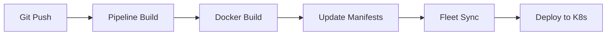

# Rancher Fleet Continuous Delivery Setup

This guide configures Rancher Fleet for GitOps-based continuous delivery of the MCP NestJS server.

## Prerequisites

- RKE/Rancher Kubernetes cluster
- Fleet installed and configured in Rancher
- Docker registry access (Docker Hub)
- Git repository access

## 1. Fleet Configuration

### Repository Structure
```
mcp-nest/
├── fleet.yaml                  # Fleet GitRepo configuration
├── kustomization.yaml         # Kustomize configuration
├── .rancher-pipeline.yml      # Rancher pipeline (optional)
├── k8s/                       # Kubernetes manifests
│   ├── deployment.yaml
│   ├── service.yaml
│   ├── configmap.yaml
│   └── ingress.yaml
└── overlays/                  # Environment-specific patches
    └── production/
        └── deployment-patch.yaml
```

### Fleet GitRepo (fleet.yaml)
The main configuration file that tells Fleet:
- Which Git repository to monitor
- Which clusters to deploy to
- How to customize deployments per environment

## 2. Rancher Setup Steps

### Step 1: Enable Fleet in Rancher
1. Log into Rancher UI
2. Go to **Cluster Management** → **Advanced** → **Fleet**
3. Ensure Fleet is installed and running

### Step 2: Create Git Repository
1. In Rancher UI, go to **Continuous Delivery**
2. Click **Git Repos** → **Add Repository**
3. Configure:
   - **Name**: `mcp-nest-server`
   - **Repository URL**: `https://github.com/your-org/mcp-nest-server`
   - **Branch**: `main`
   - **Paths**: `k8s/`

### Step 3: Configure Target Clusters
1. Add cluster labels for targeting:
```bash
kubectl label cluster local env=production
kubectl label cluster staging env=staging
```

### Step 4: Set up Secrets
Create secrets in the target namespace:
```bash
# Create namespace if needed
kubectl create namespace mcp-production

# Create secrets for SAP credentials
kubectl create secret generic mcp-secrets \
  --from-literal=SAP_USERNAME="your-username" \
  --from-literal=SAP_PASSWORD="your-password" \
  --namespace=mcp-production
```

## 3. GitOps Workflow

### Development Flow
1. **Code Changes**: Push code to feature branch
2. **CI Pipeline**: Automated build and test
3. **Build Image**: Create Docker image with tag
4. **Update Manifests**: Update image tags in k8s manifests
5. **Fleet Sync**: Fleet automatically deploys to clusters

### Deployment Process


## 4. Environment Management

### Staging Environment
- Automatic deployment on any branch push
- Lower resource limits
- Test configurations

### Production Environment  
- Manual approval or main branch only
- Higher resource limits
- Production secrets and configs

## 5. Fleet Commands

### Monitor Fleet Status
```bash
# Check Fleet workloads
kubectl get gitrepos -A

# Check deployment status
kubectl get bundles -A

# View Fleet logs
kubectl logs -n cattle-fleet-system deployment/fleet-controller
```

### Force Fleet Sync
```bash
# Trigger immediate sync
kubectl annotate gitrepo mcp-nest-server -n fleet-default \
  fleet.cattle.io/commit=$(date +%s)
```

## 6. Troubleshooting

### Common Issues

1. **Repository Access**
   - Ensure Git credentials are configured
   - Check repository URL and branch

2. **Cluster Targeting**
   - Verify cluster labels match selectors
   - Check cluster health in Rancher

3. **Secrets Missing**
   - Ensure secrets exist in target namespace
   - Verify secret names match deployment

4. **Image Pull Issues**
   - Check Docker registry credentials
   - Verify image tags and repository access

### Debug Commands
```bash
# Check Fleet bundle status
kubectl describe bundle mcp-nest-server -n fleet-default

# View deployment events
kubectl describe deployment mcp -n default

# Check pod logs
kubectl logs -l app=mcp -n default
```

## 7. Security Considerations

- Store sensitive data in Kubernetes secrets
- Use RBAC for Fleet access control
- Enable TLS for all communications
- Regularly rotate credentials
- Monitor deployment activities

## 8. Monitoring and Alerting

Set up monitoring for:
- Deployment success/failure
- Application health checks
- Resource utilization
- Fleet controller health

## 9. Backup and Disaster Recovery

- Backup Kubernetes manifests in Git
- Store secrets in secure secret management
- Document environment configurations
- Test disaster recovery procedures

This configuration provides a robust GitOps workflow using Rancher Fleet for continuous delivery of your MCP server to RKE clusters.